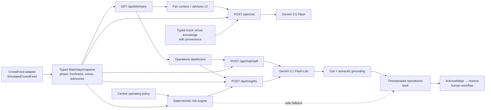

# FanPulse AI architecture

FanPulse AI is a FIFA World Cup 2026 challenge prototype. It combines typed mock venue knowledge with one timestamped, server-generated matchday snapshot so fan guidance and staff decisions cannot silently disagree.

## System view

All provider calls happen on the Next.js server. The browser never receives the Gemini key or model configuration.

## Responsibility boundaries

| Boundary | Primary files | Responsibility |
| --- | --- | --- |
| Domain policy | `lib/crowdData.ts`, `lib/operationsPolicy.ts`, `lib/operations.ts` | Typed zone IDs, shared thresholds, risk scoring, ranking, owners, and recheck windows |
| Matchday feed | `lib/matchday.ts`, `app/api/telemetry/route.ts` | Adapter contract, deterministic demo adapter, snapshot identity/freshness, phase, advisories |
| Venue knowledge | `data/stadiumKnowledge.ts`, `lib/knowledgeCategories.ts`, `lib/stadiumData.ts` | Mock provenance, typed facts, multilingual category selection, prompt serialization |
| Fan experience | `components/ChatInterface.tsx`, `components/chat/`, `components/FanContextControls.tsx` | Location/access preference, safe transcript, streamed chat, active advisory |
| Staff experience | `components/StaffDashboard.tsx`, `components/staff/`, `hooks/` | Feed lifecycle, metrics, stale-brief detection, provenance, acknowledgement workflow |
| AI prompts/services | `lib/chatPrompts.ts`, `lib/chatRoute.ts`, `lib/insightGeneration.ts` | Grounded prompts, streaming, model generation, semantic output checks, fallback |
| Contracts | `lib/languages.ts`, `lib/validation.ts`, `lib/insights.ts` | Shared enums, request validation, response schemas, client runtime parsing |
| HTTP safeguards | `lib/httpSecurity.ts`, `lib/rateLimiter.ts`, `lib/requestSecurity.ts` | Bounded JSON, origin checks, safe responses, scoped rate limits, stable facade |
| Insight reuse | `lib/insightCache.ts` | Bounded, exact-snapshot cache; prose is never reused for a different reading |

## Shared matchday context

`CrowdFeed` is the replaceable boundary between domain logic and a future approved venue feed. The included `SimulatedCrowdFeed` is deterministic within a 15-second bucket, clearly labels its source as `simulated`, and emits:

- a unique `snapshotId`, generated time, and next-refresh time;
- match phase and minutes to kickoff;
- eight canonical zones with bounded occupancy and trend; and
- reviewed public/operational advisory text with a named owner.

The dashboard polls `GET /api/telemetry`; fan chat, staff Q&A, and insight generation independently read the same server adapter. Client-provided labels or sensor readings never enter an AI system prompt.

## Fan flow

1. The fan chooses a current location, route preference, response language, and asks a question.
2. `lib/validation.ts` retains at most eight sanitized text messages, enforces per-message/total limits, validates context enums, discards tool/file/metadata parts, and requires a final user message.
3. The server retrieves only relevant typed venue categories and adds the current match phase/advisory.
4. Active advisories override normal static routing; step-free or lower-sensory preferences remain explicit model constraints.
5. Gemini streams a phone-readable response. It may not invent gates, claim an unauthorized overflow gate is open, request personal data, or output external links.
6. Unknown facts are redirected to Guest Services; emergency language prioritizes stewards or emergency services.

## Staff decision flow

1. The dashboard derives metrics and visualizations from the latest validated server snapshot.
2. `buildOperationalInsights` produces a deterministic, phase-aware safety baseline before Gemini is called.
3. Staff explicitly refresh a brief; the API rejects a stale `snapshotId` with HTTP 409 instead of analyzing mismatched readings.
4. Gemini returns two to four structured cards. Zod bounds every field; semantic grounding removes unknown/duplicate zones or unsupported gates and restores the trusted priority, owner, and recheck interval.
5. Provider, timeout, schema, or grounding failure returns the deterministic brief with `source: rules`.
6. Each brief carries `snapshotId`, `generatedAt`, and source. New telemetry marks it stale but never overwrites it, preserving provenance.
7. Staff can acknowledge and resolve each recommendation. These controls model human review only; no physical gate or safety system is connected.

## Deterministic operating policy

- Occupancy below 70% is low density; 70–85% is moderate; above 85% is critical.
- Risk score is occupancy plus `+8` for upward, `0` for stable, or `−6` for downward movement, clamped to 0–100.
- Risk is low below 65, moderate at 65–79, high at 80–89, and critical at 90+.
- Gate C2 is the only supported overflow gate and can be activated only after control-room authorization.
- The current demo scenario is ingress, so crowd recommendations prioritize safe arrival flow.
- AI recommendations are advisory and always require authorized human verification.

The single `OPERATIONS_POLICY` object drives domain thresholds and UI legends, preventing contradictory classifications.

## Reliability and efficiency

| Condition | Behavior |
| --- | --- |
| Missing API key | Controlled service-unavailable chat response; deterministic operations still work |
| Invalid JSON/type/size | Rejected with 400/415/413 before model work |
| Untrusted browser origin | Rejected with 403 |
| Request limit exceeded | 429 with `Retry-After` |
| Snapshot changes before insight request | 409; client refreshes rather than mixing snapshots |
| Gemini insight failure | Rules brief with explicit source |
| Telemetry changes after a brief | Existing brief stays pinned and is visibly marked stale |
| Component unmount or superseding request | Fetch is aborted and cannot update newer state |

AI calls are on demand. Chat history/output are capped, venue context is selected by category, insight output is bounded, the exact-snapshot cache prevents duplicate calls without stale percentages, and the native CSS chart avoids a charting dependency. Polling pauses in hidden tabs.

## Production evolution

The demo deliberately avoids pretending to be production infrastructure. A venue deployment should add authenticated staff roles, signed/versioned telemetry, distributed rate limiting, audit persistence, incident-command integration, reviewed multilingual content, privacy/retention controls, observability, and provider resilience. Physical control must remain outside the model boundary.
