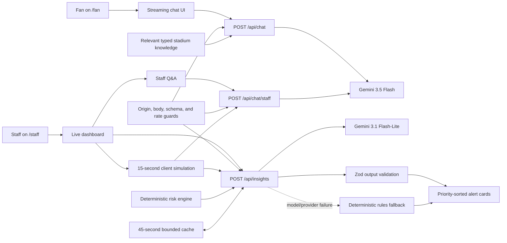

# FanPulse AI architecture

This document explains how FanPulse AI turns static venue knowledge and a changing crowd snapshot into grounded fan guidance and human-reviewed operational recommendations.

## System view

There are no direct browser-to-provider calls. The API key and model configuration stay on the Next.js server.

## Responsibilities

| Layer | Primary files | Responsibility |
| --- | --- | --- |
| Routes and layout | `app/` | App Router pages, metadata, and server endpoints |
| Fan experience | `components/ChatInterface.tsx` | Language override, suggestions, streaming messages, errors, and stop control |
| Staff experience | `components/StaffDashboard.tsx` | Live state, metrics, visualization, insight refresh, and source labeling |
| Operational Q&A | `components/StaffAskAI.tsx` | Sends each question with the current zone snapshot |
| Domain data | `lib/stadiumData.ts`, `lib/crowdData.ts` | Typed mock venue knowledge and crowd simulation |
| AI boundary | `lib/ai.ts`, `lib/chatRoute.ts`, `app/api/*` | Server-only provider setup, separate fan/staff routes, prompts, streaming, grounding, and fallback behavior |
| Recommendation contract | `lib/insights.ts` | Output schema, TypeScript type, source type, and priority sort |
| Deterministic operations | `lib/operations.ts` | Trend-aware risk scoring, metrics, ranking, and safe baseline recommendations |
| Trust boundaries | `lib/validation.ts`, `lib/requestSecurity.ts` | Sanitized text, canonical zones, body/origin limits, rate limits, safe responses, and redacted logs |
| Insight reuse | `lib/insightCache.ts` | Bounded 45-second reuse for equivalent zone snapshots |

## Fan request flow

1. The fan types a question, uses a quick suggestion, and optionally selects a response language.
2. `ChatInterface` sends UI messages and a language choice to the fan-only `POST /api/chat` route.
3. The shared request guard enforces same-origin browser requests, JSON content, a 32 KiB body, a scoped rate limit, and a Zod envelope.
4. The validator keeps up to eight valid user/assistant text messages, discards non-text parts, caps each message at 2,000 characters and all context at 8,000 characters, and requires a final user message.
5. The server selects relevant categories from the typed knowledge base; an unmatched question receives the full context. The prompt explicitly disallows invented gates, times, services, and policies.
6. Gemini streams a response through the Vercel AI SDK to the accessible live region in the chat UI.
7. Unknown venue facts are redirected to Guest Services; emergency language prioritizes nearby staff and emergency services.

The knowledge base covers gates, sections, accessibility services, transport, sustainability stations, and frequently asked policies. Keeping it typed and centralized makes facts reviewable and prevents inconsistent copies across components.

## Staff insight flow

1. `StaffDashboard` holds eight typed zones. Every 15 seconds, `jitterZones` applies a bounded change and may update a trend; updates pause while the tab is hidden.
2. Metrics, the grid map, and the native accessible occupancy chart derive from that same state.
3. A staff member explicitly requests new insights; background refreshes do not spend model tokens.
4. `POST /api/insights` accepts two to eight unique IDs from A–H with integer occupancy and a known trend. It ignores client-supplied labels/capacities and restores those facts from the canonical server snapshot.
5. `buildOperationalInsights` calculates a deterministic, trend-aware baseline before the model is called.
6. A 45-second cache reuses equivalent snapshots. On a miss, Gemini is asked to rewrite the baseline into two to four structured items matching the shared schema.
7. Output grounding removes unknown/duplicate zones and unsupported gate claims, restores deterministic priority, and sorts `high`, `medium`, then `low`.
8. If the provider, timeout, parsing, schema, or grounding check fails, the deterministic baseline is returned with `source: "rules"`. The UI identifies the source.

Staff Q&A uses the separately rate-limited `/api/chat/staff` route. It receives a canonicalized current zone array for each request and tells staff to verify control-room actions. Keeping the fan endpoint fan-only removes a client-selectable privilege mode, although the public demo still requires authentication before real operational data could be connected.

## Deterministic operating rules

- `< 70%`: normal/low density.
- `70–85%`: moderate density; upward trends require monitoring.
- `> 85%`: high-priority pressure point.
- Operational risk score = occupancy plus `+8` for an upward trend, `0` for stable, or `−6` for downward, clamped from 0–100.
- Risk levels are low below 65, moderate at 65–79, high at 80–89, and critical at 90+.
- Zone C can use Gate C2 as a supported overflow action.
- Occupancy is clamped between 20% and 98% during simulation.
- Recommendations are sorted by priority and remain advisory.

These rules make the core safety behavior inspectable. GenAI adds natural-language analysis and context-specific action phrasing; it is not the only path to a useful result.

## Reliability and failure behavior

| Failure | User-visible behavior |
| --- | --- |
| Missing API key | Server returns a controlled service-unavailable response |
| Empty chat payload | Server rejects the request rather than calling the model |
| Invalid JSON/content type/oversized body | Server returns HTTP 400/415/413 before validation or model work |
| Invalid insight payload | Server returns HTTP 400 with a stable error shape |
| Untrusted/duplicate sensor identity | Canonical validation rejects it; names and capacities never enter from the client |
| Cross-origin browser request | Server returns HTTP 403 |
| Rate exceeded | Server returns HTTP 429 with `Retry-After` |
| Gemini insight failure | Deterministic recommendations are returned with `source: "rules"` |
| Chat stream failure | UI shows a retryable error; no fabricated fallback answer is presented |
| Browser unmount | Simulation interval is cleaned up |

## Efficiency boundaries

- Static data is bundled and typed; no demo database is required.
- Sensor simulation is local and makes no network request.
- AI calls are on demand; repeated equivalent insight snapshots use a bounded 45-second cache.
- Chat history and output tokens are capped.
- Fan context retrieval normally sends only the knowledge categories relevant to the latest question.
- The eight-bar chart is native HTML/CSS with an accessible summary/table, avoiding a client charting dependency.
- Heavy persona destinations disable automatic route prefetch on the landing page.
- Low model temperature favors consistent operational responses.
- One shared server handler avoids duplicated provider configuration while public endpoints and rate scopes remain separate.
- UI modules isolate stateful behavior from reusable visualization and presentation components.

## Production evolution

The demo has deliberately narrow infrastructure. A venue deployment should add:

1. authenticated staff roles and fine-grained permissions;
2. distributed identity-aware rate limiting, stronger abuse protection, audit trails, and observability;
3. an approved retrieval layer for versioned venue content;
4. signed sensor events or a read-only operational data adapter;
5. multilingual content review and bidirectional-layout QA;
6. incident command escalation, acknowledgement, and recommendation provenance;
7. privacy and retention controls agreed with venue operators; and
8. provider redundancy and operational service-level objectives.

Physical control must remain outside the model boundary. A model may recommend opening or closing a route, but an authorized human and approved operations system must execute it.
